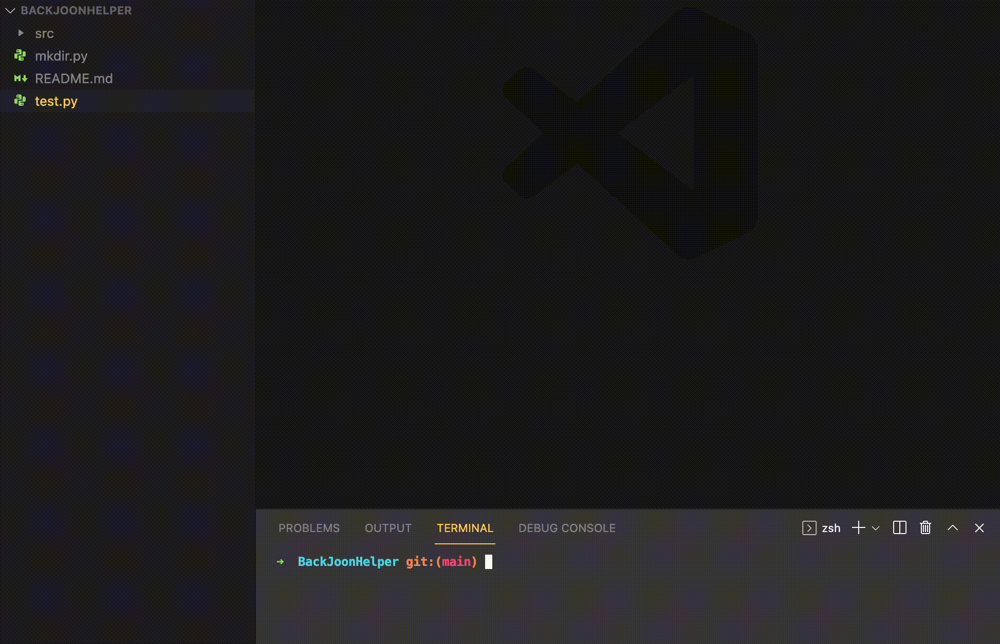
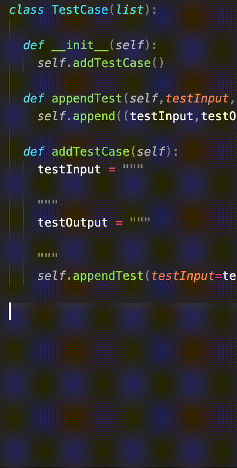
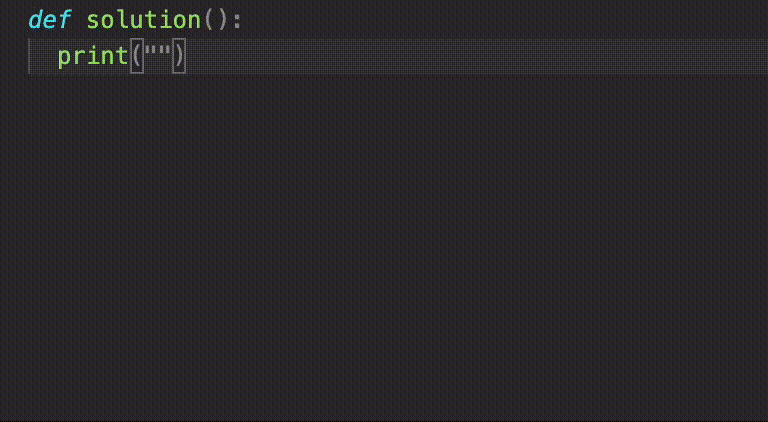
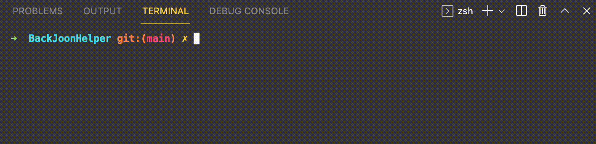
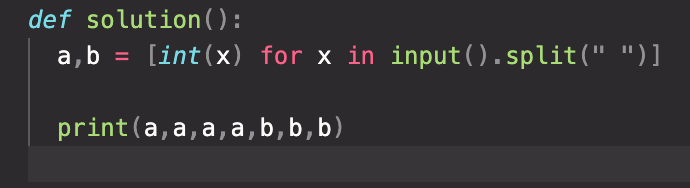
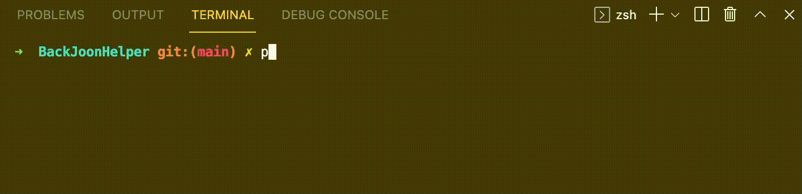
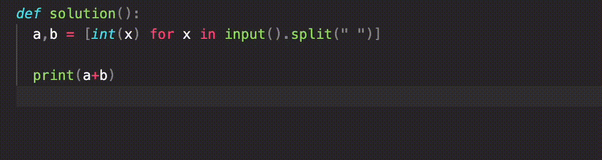

# BaekJoonHelper with Python

매번 Input을 집어넣기 귀찮아서 만들었습니다  

아직 별로 테스트를 하지 못하여 오류가 많을테니 미리 죄송하고 버그나 불편한 점 알려주시면 감사하겠습니다  

## Usage

#### 설치 
> [다운로드 링크](https://github.com/ukcastle/BaekJoonHelper/releases/download/v1.0/bj_helper_1.0.tar.gz)  

```sh  
or

wget https://github.com/ukcastle/BaekJoonHelper/releases/download/v1.0/bj_helper_1.0.tar.gz  

or

git clone https://github.com/ukcastle/BaekJoonHelper
```

#### 라이브러리 다운로드
```sh
pip3 install urllib3 beautifulsoup4

or 

pip install urllib3 beautifulsoup4

or 

pip3 install -r requirments
```
이후 python3로 통일하겠습니다 

<br>

#### mkdir.py

```sh
python3 mkdir.py {문제 번호}
```


동일한 번호의 폴더가 2개이상 존재하는걸 일단 막아뒀습니다

<br>

#### 문제번호/test_case.py에 테스트케이스 입력


이 부분은 추후 좀 더 편하게 개선해야겠어요  

<br>

#### 문제번호/solution.py에 코드 입력


프로그래머스와 같이 solution에 알고리즘을 정의합니다 

<br>

#### test.py

```sh
python3 test.py {문제번호}
```

  

기존 unittest에서 쓰이던 -v, -b 등등의 인자들까지 모두 지원합니다  


<br>

#### test.py --test

```sh
python3 test.py {문제번호} --test
```

  

만약 검사 없이 출력값만 확인해보고싶다면 `--test` 인자를 붙여줍니다  

  

<br>

#### 제출할 때...  

  

아직은 마땅한 방법이 생각이 나지 않아서 위와 같이 맨 아래에 solution() 함수를 적고 백준에 제출하는 방식으로 하고있습니다.  
괜찮은 아이디어가 있으면 알려주시면 감사하겠습니다...  